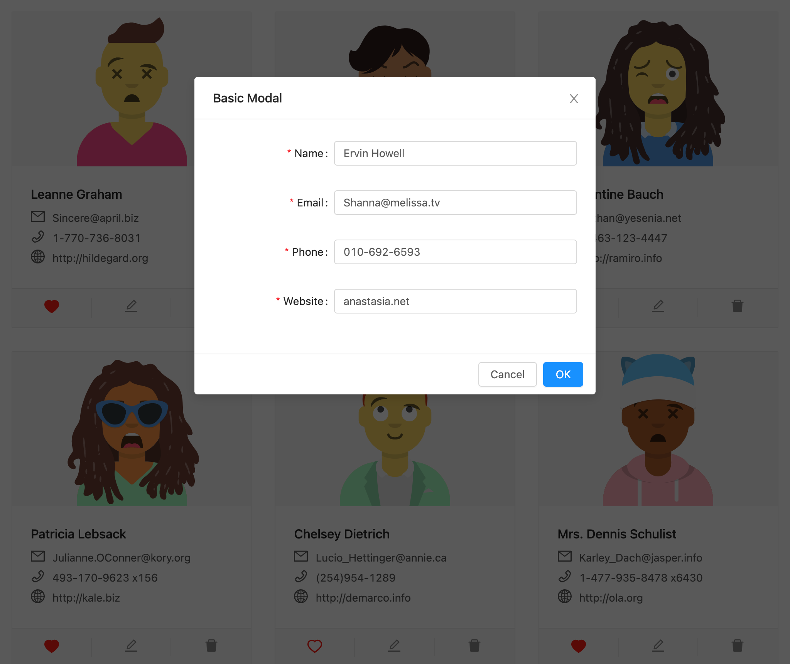

# Frontend Assignment : Contacts App (Deployed on [holly-assignment](https://holly-assignment.netlify.app/))

## Summary

Your task is to create a **responsive** single page React application that displays the profile of 10 users. Each user's profile contains an avatar and some information about them. and support functionalities like Like, Edit, Delete.

## Requirements

- It has a single page listing all the users in grid format
- The data for the users should be fetched from the given API (See API Endpoints below)
- Each profile will contain an avatar. You should use [Avatars by DiceBear](https://avatars.dicebear.com/) API to fetch the avatars (See API Endpoints below)
- The page should be responsive
- Each of your component should have good unit tests.
- While data is being fetched, you can add a loading indicator. (Can be obtained [here](https://tobiasahlin.com/spinkit/))
- You should implement any of the Like, Edit, Delete functionalities. (See images for clarity)
- when you implement any of the above functionality, you may use browser local storage for storing the changes.
- Please take a look at the screenshots. Your aim is to create a similar app, though you have freedom to enhance the design if you want.
- You may use any CSS library/framework that you are comfortable with for the designs. For example, you may use [Ant Design](https://ant.design/)

## Submission

Please create a **private** GitHub repository with your code and share access with @mahmoud63.
Mail us the link to your GitHub repo within the given time.

#### Deployment (Optional)

- You may deploy your code and mail us the link along the Github repo
- You may find [this document](https://create-react-app.dev/docs/deployment/) helpful for any doubts regarding deployment

## Evaluation Criteria

With this assignment we aim to evaluate the following aspects:

- Code Quality in terms of Reliability, Maintainability, Testability, and Reusability.
- Understanding of JSX, props and components, and state management
- Handling of API endpoints
- Conditional rendering
- Working with lists

The app needs to be responsive, and will be tested on Chromium and Firefox browsers against different dimensions.

## General Tips

- Feel free to use any online resources.
- Examine the screenshots closely for any design elements.
- Try to complete one functionality before building another. It is better to miss features, than provide half-baked features.
- Test the APIs on your browser or tools like Postman to understand the response schema better.

## API Endpoints

### For users data

All 10 users profile data is to be downloaded from the following API endpoint:

```
Method: GET
URL: https://jsonplaceholder.typicode.com/users
```

The schema of the data received in the response is:

```Javascript
// Array of 10 users
[
  {
    id,	// The user's id
    username,
    name,
    email,
    phone,
    website,
    address: {
	  street, // Address line 1
	  suite, // Address line 2
	  city,
	  zipcode
    },
    company: {
	  name, // The name of company where the user works
    }
  }
]
```

### For users' avatar pictures

You will be using [Avatars by DiceBear](https://avatars.dicebear.com/). They provide a free HTTP API to create unique avatar images based on any string we send as query parameter. Each string generates a unique image. You will use the `username` to generate a unique avatar for each user.

The URL for the `GET` endpoint is:

```
https://avatars.dicebear.com/v2/avataaars/{{username}}.svg?options[mood][]=happy
```

The `{{username}}` in the URL is the placeholder for the user's username. It should be dynamically replaced by the username received from the users API endpoint. For example, if the username for one of the users is `psamd` then the URL for the avatar for this user will be:

```
https://avatars.dicebear.com/v2/avataaars/psamd.svg?options[mood][]=happy
```

## Screenshots

Dimensions: 1024 x 926


Edit Mode



Dimensions: 375 x 926


Please find the other dimensions in the directory Screenshots.
